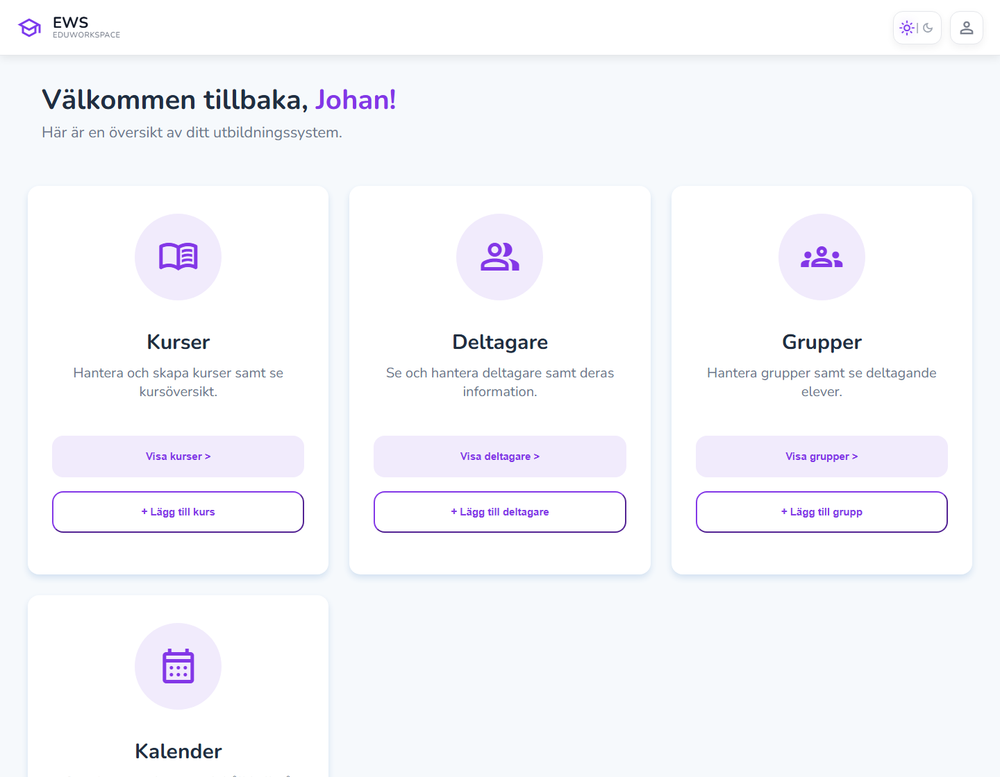
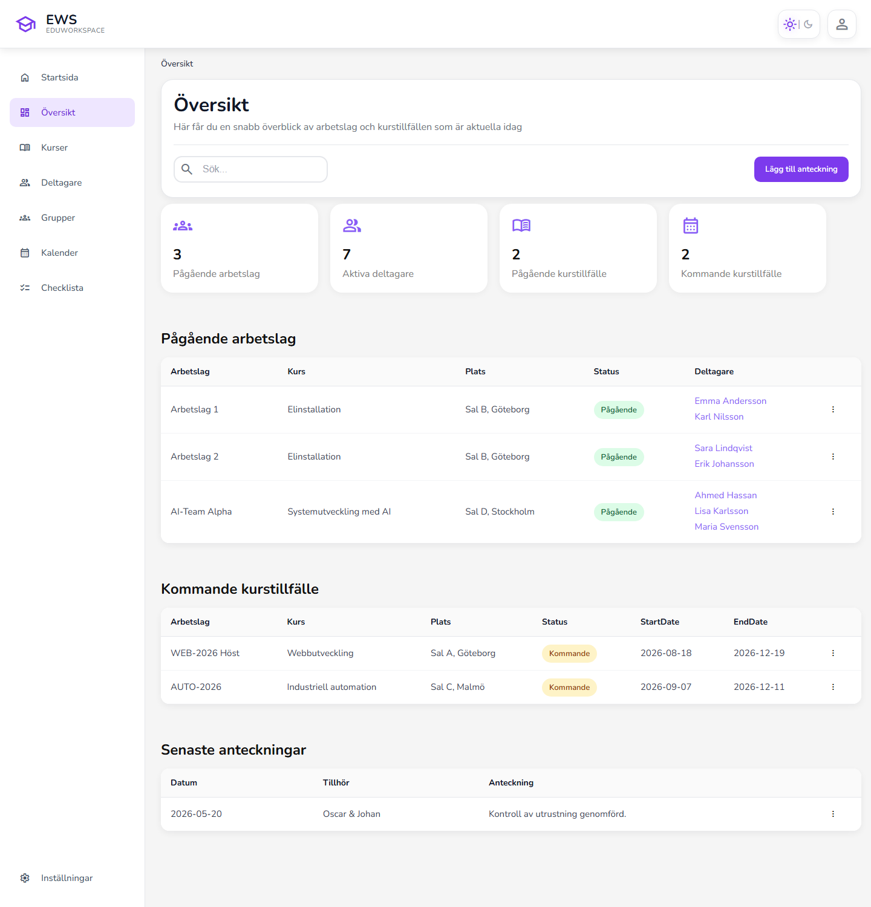
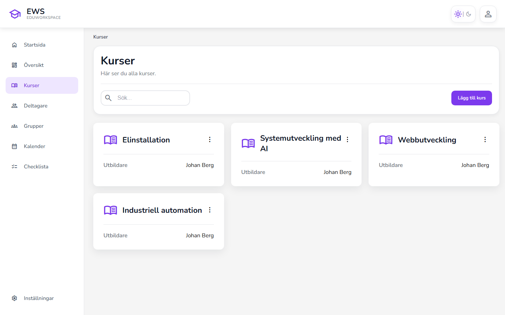
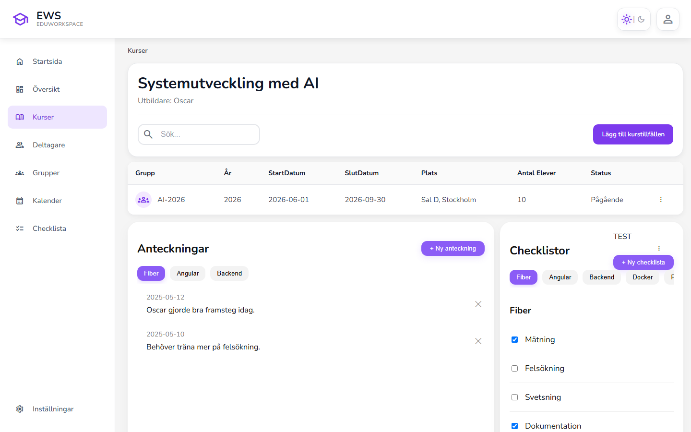
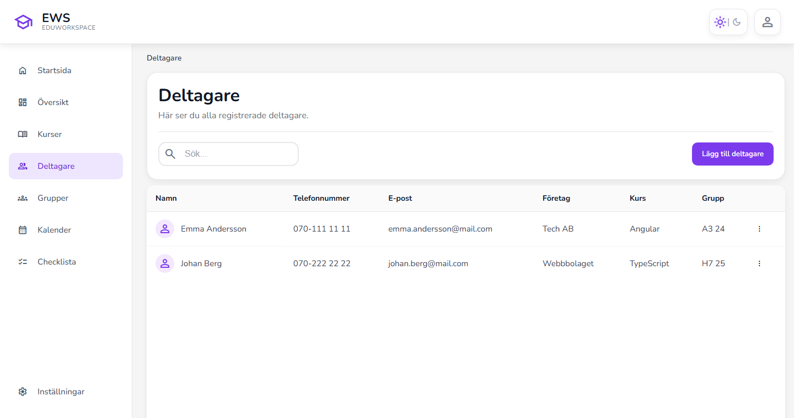
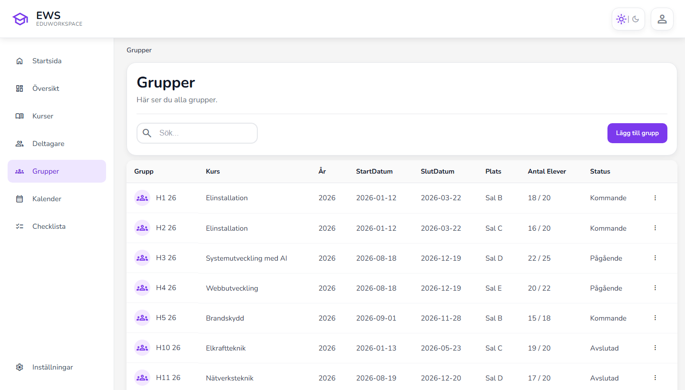
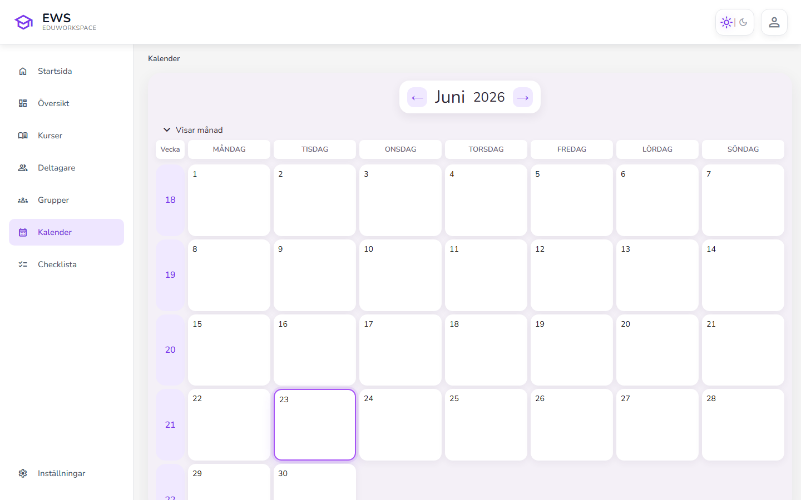
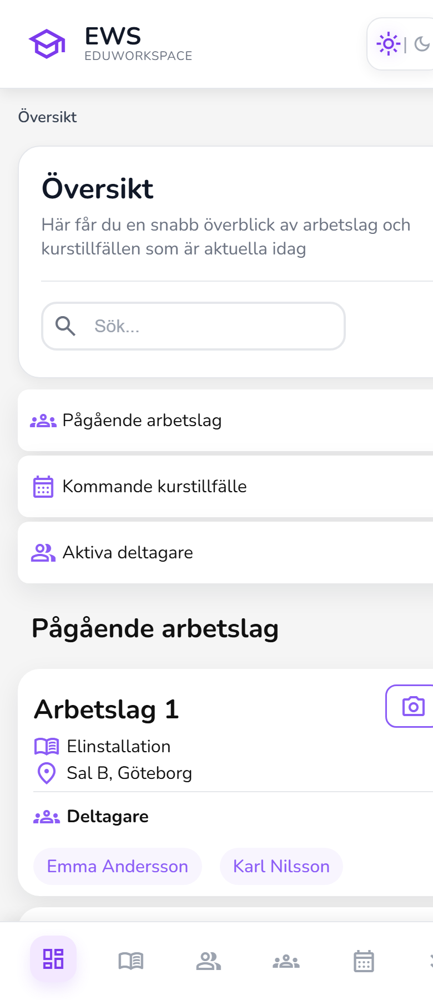

<div align="center">

#  EduWorkspace (EWS)

**Ett digitalt verktyg som ersätter manuell pappers- och mapphantering vid utbildningar – byggt med Angular och ASP.NET Core.**


</div>

---

##  Innehåll

- [Vad är EduWorkspace?](#-vad-är-eduworkspace)
- [Problemet vi löser](#-problemet-vi-löser)
- [Skärmdumpar](#-skärmdumpar)
- [Funktioner](#-funktioner)
- [Teknik & arkitektur](#-teknik--arkitektur)
- [Datamodell](#-datamodell)
- [Kom igång](#-kom-igång)
- [Projektstruktur](#-projektstruktur)
- [Status & vidareutveckling](#-status--vidareutveckling)
- [Om projektet](#-om-projektet)

---

##  Vad är EduWorkspace?

**EduWorkspace** (EWS) är en webbapplikation som hjälper utbildningsansvariga att hålla ordning på
**kurser, deltagare, grupper och dokumentation** på ett och samma ställe.

Istället för att leta i utspridda mappar, textfiler och bilder samlar EduWorkspace allt i ett tydligt,
mobilanpassat gränssnitt. Den ansvariga läraren kan snabbt se vilka kurser som pågår, vilka deltagare
som ingår i vilka arbetslag, och dokumentera anteckningar, bilder och checklistor direkt – även ute på fält.

> Applikationen riktar sig till **den utbildningsansvariga**, inte till kursdeltagarna.

---

##  Problemet vi löser

Idag hanteras mycket av dokumentationen manuellt. För varje utbildningsmoment och varje grupp skapas mappar
fyllda med anteckningar och bilder, som till slut ska sammanställas och skickas in till relevanta myndigheter.
En typisk mappstruktur kan se ut så här:

```text
kursnamn-2026
├── Arbetslag-1
│   ├── anteckningar-deltagare-a.txt
│   ├── anteckningar-deltagare-b.txt
│   ├── bild1.jpg
│   └── bild2.jpg
└── Arbetslag-2
    ├── anteckningar-deltagare-c.txt
    └── bild1.jpg
```

Det blir snabbt rörigt, svårt att överblicka och tidskrävande att hålla uppdaterat.

**EduWorkspace digitaliserar hela det här arbetsflödet** – samma struktur, men sökbar, samlad och tillgänglig
direkt i mobilen eller på datorn.

---

##  Skärmdumpar

### Startsida – snabb överblick
Den ansvariga möts av en personlig översikt med direktlänkar till kurser, deltagare, grupper och kalender.



### Översikt (dashboard) – allt som är aktuellt idag
Statistik över pågående arbetslag, aktiva deltagare och kommande kurstillfällen, samt tabeller med
pågående/kommande kurstillfällen och de senaste anteckningarna.



### Kurser
Alla kurser listas med ansvarig utbildare. Nya kurser kan skapas direkt i gränssnittet.



### Kursdetaljer – anteckningar & checklistor
Per kurs och kurstillfälle kan man föra anteckningar (kategoriserade med taggar) och bocka av checklistor –
precis den dokumentation som tidigare låg utspridd i textfiler.



### Deltagare
Samtliga deltagare med kontaktuppgifter, företag, kurs och grupp.



### Grupper / arbetslag
Översikt över alla grupper med kurs, datum, plats, antal platser och status.



### Kalender
Månadsvy för att planera och hålla koll på viktiga datum.



### Mobilanpassad vy
Applikationen är byggd som en PWA och fungerar lika bra i mobilen – med egen mobillayout, bottennavigering
och snabbknapp för att ta bilder ute på fält.

<div align="center">
  
</div>

---

##  Funktioner

| Funktion | Beskrivning |
| --- | --- |
|  **Kurser** | Skapa, redigera och ta bort kurser samt koppla ansvarig utbildare. |
|  **Kurstillfällen** | Lägg upp kurstillfällen med start-/slutdatum och plats. |
|  **Deltagare** | Registrera deltagare med kontaktuppgifter, företag och grupptillhörighet. |
|  **Grupper / arbetslag** | Organisera deltagare i grupper kopplade till ett kurstillfälle. |
|  **Anteckningar** | För anteckningar på kurs-, grupp- eller deltagarnivå, taggade efter ämne. |
|  **Checklistor** | Skapa återanvändbara checklistor och bocka av moment. |
|  **Kalender** | Planera och visualisera viktiga datum i en månadsvy. |
|  **Översikt/Dashboard** | Realtidsstatistik över pågående arbetslag, aktiva deltagare och kommande tillfällen. |
|  **Fältdokumentation** | Snabbknapp för kamera direkt i mobilvyn (bilder ute på plats). |
|  **PWA / mobilanpassad** | Installerbar webbapp med responsiv layout och offline-stöd via service worker. |
|  **Tema** | Växla mellan ljust och mörkt läge. |

---

##  Teknik & arkitektur

EduWorkspace är en klassisk **klient–server-applikation** där en Angular-frontend kommunicerar med ett
ASP.NET Core-backend via ett REST-API.

```text
┌─────────────────────────┐        HTTP / REST (JSON)        ┌──────────────────────────┐
│      Angular 21 (SPA)    │  ──────────────────────────────▶ │   ASP.NET Core 10 (API)  │
│  • Standalone components │   GET/POST/PUT/DELETE /api/...    │  • Minimal API endpoints │
│  • Signals               │ ◀────────────────────────────── │  • Entity Framework Core │
│  • PWA / service worker  │        OpenAPI / Swagger          │  • CORS-policy           │
└─────────────────────────┘                                   └────────────┬─────────────┘
                                                                            │ EF Core
                                                                            ▼
                                                                  ┌──────────────────┐
                                                                  │   SQLite (app.db) │
                                                                  └──────────────────┘
```

**Frontend**
- [Angular 21](https://angular.dev/) med fristående (standalone) komponenter och signals
- TypeScript
- PWA-stöd via `@angular/service-worker`
- Material Symbols & Nunito för UI
- API-klient som **autogenereras** från backendens OpenAPI-schema med [NSwag](https://github.com/RicoSuter/NSwag)

**Backend**
- [ASP.NET Core 10](https://dotnet.microsoft.com/en-us/apps/aspnet) med [Minimal API](https://learn.microsoft.com/en-us/aspnet/core/fundamentals/minimal-apis)
- [Entity Framework Core](https://learn.microsoft.com/en-us/ef/core/) med Code-First-migrationer
- SQLite som databas
- OpenAPI/Swagger-dokumentation (NSwag)
- CORS-policy konfigurerad för Angular-klienten

---

##  Datamodell

Databasen är modellerad med Entity Framework Core (Code First). Centrala entiteter är **kurser**,
**kurstillfällen**, **användare/deltagare**, **grupper (teams)** samt kopplingstabeller för relationer –
plus stöd för **anteckningar**, **bilder**, **filer** och **checklistor**.


---

##  Kom igång

### Förutsättningar
- [.NET 10 SDK](https://dotnet.microsoft.com/download)
- [Node.js 20+](https://nodejs.org/) och npm
- [Entity Framework Core-verktyg](https://learn.microsoft.com/en-us/ef/core/cli/dotnet): `dotnet tool install --global dotnet-ef`

### 1. Starta backend (API)

```bash
cd Server
dotnet ef database update     # skapar SQLite-databasen från migrationerna
dotnet run                    # startar API:t på http://localhost:5138
```

Swagger-UI finns på `http://localhost:5138/swagger` när servern körs i utvecklingsläge.

### 2. Starta frontend (Angular)

```bash
cd Client
npm install
npm start                     # startar dev-servern på http://localhost:4200
```

Öppna sedan **http://localhost:4200** i webbläsaren.

>  Den genererade API-klienten kan uppdateras med `npm run gen-api` (kräver att backend körs).

---

##  Projektstruktur

```text
Eduworkspace/
├── Client/                     # Angular-frontend (SPA + PWA)
│   └── src/app/
│       ├── components/         # Återanvändbara UI-komponenter (header, sidebar, modaler, kalender ...)
│       ├── pages/              # Vyer (start, kurser, deltagare, grupper, översikt, kalender ...)
│       └── services/           # Autogenererad API-klient (NSwag)
├── Server/                     # ASP.NET Core-backend (Minimal API)
│   ├── Models/                 # EF Core-entiteter
│   ├── Routes/                 # API-endpoints (kurser, deltagare, översikt ...)
│   ├── Data/                   # AppDbContext
│   └── Migrations/             # EF Core Code-First-migrationer
├── docs/                       # Dokumentation, databasschema & skärmdumpar
└── specs.md                    # Kravspecifikation
```

---

##  Status & vidareutveckling

EduWorkspace är ett aktivt utvecklingsprojekt. Grundfunktionerna för kurser, deltagare, grupper, anteckningar,
checklistor, kalender och översikt är på plats. På önskelistan/roadmappen finns bland annat:

-  **Röstanteckningar** med automatisk tal-till-text för dokumentation ute på fält
-  **Uppladdning av bilder och filer** på kurs-, grupp- och deltagarnivå
-  **Deltagarvy** som samlar allt en person varit involverad i (kurs, grupp och individnivå)
-  **Inloggning & behörigheter**
-  **Android-app** som komplement till webbappen

---

##  Om projektet

EduWorkspace har utvecklats som ett **grupprojekt** inom en utbildning i systemutveckling, med fokus på en
modern och relevant teknikstack (Angular + ASP.NET Core). Projektet visar arbete med full-stack-utveckling:
REST-API:er, relationsdatabas och migrationer, autogenererad API-klient, responsiv frontend och versionshantering
med Git/GitHub i ett team.
